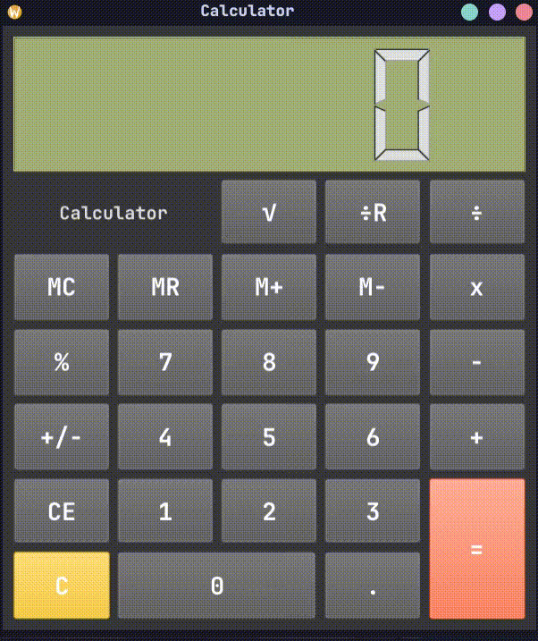

# QtCalculator


**Qt Calculator** is a modern and multiplatform calculator app.
Developed in Python with the framework PySide6 (Qt), it gives a seamless user interface and a robust handling of mathematical errors.

<br>


---

## Key features

* **Core operations:** 
  * Standard arithmetic operations (+, -, x, ÷, %, ÷R).
  * Memory management (MC, M+, M-, MR).
  * Square root and sign toggle.
  * High precision calculation using Python's Decimal module.
* **Reactive Interface:** Graphical elements dynamically adjust to the window size using adaptive layouts, such as (`QGridLayout`).
* **Error Handling:** Prevent mathematical errors with clear messages (e.g., *“Can't divide by zero,”* *“Cannot take square root of negative number”*).
* **Cross-platform:** The executables are generated for **Windows**, **macOS**, and **Linux** using PyInstaller.


## Technical Info

* **Language:** Python 3
* **Graphical User Interface:** PySide6 (Qt for Python)
* **Build & Packaging:** PyInstaller
* **CI/CD:** GitHub Actions

---

## Download and Installation

Download the latest version for your operating system from the [Releases](../../releases) page.

* **Windows:** Download the `.zip` file for windows and run the executable.
* **macOS:** Download the `.dmg` file and drag the application into your *Applications* folder.
* **Linux:** Download the archive or the AppImage.

---

## Local Installation

If you'd like to see the code, here's how to run it locally:

1. **Clone the repository:**
   ```bash
   git clone https://github.com/Isma-a/QtCalculator.git
   cd QtCalculator
   ```

2. **Create a virtual environment (optional):**
    ```bash
    python -m venv venv
    # On macOS/Linux:
    source venv/bin/activate
    # On Windows:
    venv\Scripts\activate
    ```
   
3. **Install dependencies:**
    ```bash
    pip install -r requirements.txt
    ```

4. **Run the application:**
    ```bash
    python calculator.py
    ```

## About

This is a personal project created to practice my skills in Python desktop application development and UI design using Qt. Feel free to explore the code!